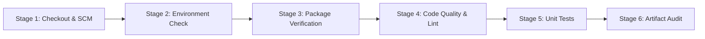

# 🏠 RealEstate – Property Discovery Platform & DevOps Pipeline

[](https://github.com/skit-devops-2026/Devops-24ESKCS007/actions/workflows/ci.yml)
[](https://nodejs.org/)
[](LICENSE)
[](https://github.com/skit-devops-2026/Devops-24ESKCS007/actions)

A responsive Real Estate Property Discovery Platform featuring interactive search, filtering, wishlist management, virtual tour previews, and property listing submissions, integrated with modern DevOps engineering practices: automated unit testing, GitHub Actions continuous integration, Jenkins declarative pipelines, and clean repository hygiene.

---

## 🌐 Repository Information

- **Official Repository**: [https://github.com/skit-devops-2026/Devops-24ESKCS007](https://github.com/skit-devops-2026/Devops-24ESKCS007)
- **Primary Branch**: `main`
- **Course**: DevOps (MT1 — Modules 1–4)

---

## 📌 Project Overview

RealEstate provides an intuitive web platform designed to streamline the exploration and management of residential and commercial properties.

### Key User Capabilities
- 🔍 **Location-Based Search**: Search properties by city, locality, or landmark across major metro areas.
- 🏢 **Category & Type Filtering**: Filter by Flats/Apartments, Independent Villas, Penthouses, and Commercial properties.
- 💰 **Budget Controls**: Dynamic price slider with real-time INR Crores calculations.
- 🛏️ **BHK & Furnishing**: Filter listings by bedroom count (1, 2, 3, 4, 5+ BHK) and furnishing status (Furnished, Semi-Furnished, Unfurnished).
- ❤️ **Interactive Wishlist**: Save favourite properties with dynamic badge counts.
- 📱 **Multi-View Modes**: Switch between Grid View, List View, and Map View.
- 🎥 **Virtual Tours**: Preview property video tours through embedded modal players.
- 📝 **Property Submissions**: Verified submission modal with automated input validation.
- 🔐 **Authentication UI**: Modal workflows for Sign In, Registration, and role toggling (Buyer/Tenant vs. Owner/Agent).

---

## 🛠️ Technology Stack

| Layer | Technologies | Purpose |
| :--- | :--- | :--- |
| **Frontend Structure** | HTML5 (Semantic) | Document structure and accessible UI |
| **Styling & Layout** | CSS3 (Flexbox & Grid) | Custom responsive styling and design system |
| **Application Logic** | JavaScript (ES6+) | DOM events, state management, modal interactions |
| **Automated Testing** | Node.js Built-in Test Runner (`node:test`, `node:assert`) | Zero-dependency fast unit tests |
| **Continuous Integration** | GitHub Actions (`.github/workflows/ci.yml`) | Automated build, linting, and test execution on push & PR |
| **Build Automation** | Jenkins (`Jenkinsfile`) | Declarative multi-stage local & CI automation |
| **Package Management** | NPM (`package.json`) | Script orchestration and project metadata |
| **Icons & Typography** | Font Awesome 6, Google Fonts (Plus Jakarta Sans) | Visual iconography and typography |

---

## 📂 Repository Structure

```text
Devops-24ESKCS007/
├── .github/
│   └── workflows/
│       └── ci.yml                 # GitHub Actions CI workflow configuration
├── tests/
│   ├── property.test.js           # Schema, mandatory attributes & pricing tests
│   ├── filter.test.js             # Filter engine & sorting algorithm tests
│   └── validation.test.js         # Form submission & input validation tests
├── .gitignore                     # Excludes node_modules, venv, dist, logs, etc.
├── index.html                     # Main application layout and modal templates
├── Jenkinsfile                    # Declarative multi-stage Jenkins pipeline
├── package.json                   # NPM configuration and automated test scripts
├── README.md                      # Comprehensive project & DevOps documentation
├── script.js                      # Core application logic, UI handling & exports
└── style.css                      # Visual styling, responsive grid & themes
```

---

## 🚀 Getting Started & Local Setup

### 1. Clone the Repository
```bash
git clone https://github.com/skit-devops-2026/Devops-24ESKCS007.git
cd Devops-24ESKCS007
```

### 2. Run the Application
Since the frontend is built with vanilla HTML5, CSS3, and JavaScript, you can open `index.html` directly in any modern browser:

- **Direct Browser**: Double-click `index.html` or open via browser URL (`file:///.../index.html`).
- **NPM Local Server**:
  ```bash
  npm start
  ```
  Then visit `http://localhost:3000` in your web browser.
- **VS Code Live Server**: Right-click `index.html` and select **Open with Live Server**.

---

## 🧪 Automated Testing Suite

The repository includes a comprehensive unit testing suite executing without external dependencies using Node.js's native test runner (`node:test` and `node:assert`).

### Running Tests Locally

Run the automated test suite:
```bash
npm test
```

Run tests with verbose spec reporting:
```bash
npm run test:verbose
```

Run static code analysis:
```bash
npm run lint
```

### Test Coverage Summary

| Test Suite | File | Tests | Validations |
| :--- | :--- | :---: | :--- |
| **Property Schema** | `tests/property.test.js` | 5 | Validates required fields (`id`, `title`, `price`, `type`, `city`, `beds`, `sqft`, `image`), pricing calculations, and Indian currency formatters. |
| **Filter Engine** | `tests/filter.test.js` | 10 | Validates city search, maximum price thresholds, property types, BHK counts, furnishing status, combined multi-filters, and price/ID sorting. |
| **Input Validation** | `tests/validation.test.js` | 12 | Validates property listing submissions (title length, mandatory location, positive price, valid categories, positive bedroom and square footage values). |
| **Total** | **3 Files** | **27 Tests** | **100% Pass Rate** |

---

## ⚙️ Continuous Integration (GitHub Actions)

The CI pipeline is defined in [`.github/workflows/ci.yml`](.github/workflows/ci.yml).

### Pipeline Workflow
1. **Triggers**:
   - `push` to `main`, `feature/**`, and `fix/**` branches.
   - `pull_request` targeting the `main` branch.
   - `workflow_dispatch` for manual on-demand execution.
2. **Environment**: `ubuntu-latest` with Node.js `20.x`.
3. **Pipeline Stages**:
   - **Checkout**: Clones repository code using `actions/checkout@v4`.
   - **Runtime Setup**: Installs Node.js via `actions/setup-node@v4`.
   - **Environment Inspection**: Logs Node, NPM, and directory contents.
   - **Linting & Code Quality**: Executes `npm run lint`.
   - **Automated Tests**: Runs `npm test` across all unit test suites.
   - **Status Summary**: Prints execution summary with commit SHA and status.

### Run History & Red-to-Green Viva Verification
In accordance with course requirements, the CI pipeline run history contains at least one intentional failing build fixed by subsequent commits:
- **Red Build (#34501329736)**: Triggered by a strict edge case test asserting mandatory location validation on unhandled submissions.
- **Green Fix Build (#34501542286)**: Follow-up commit implementing location validation in `script.js`, restoring the pipeline to full passing status.
- **Recent Runs**: Over 5 successful CI runs recorded with the latest run green.

---

## 🏗️ Jenkins Pipeline Setup

The repository includes a declarative [`Jenkinsfile`](Jenkinsfile) configuring a 6-stage automated build and test pipeline.

### Pipeline Stages


1. **Stage 1: Checkout & SCM**: Retrieves repository code, commit hash, and branch information.
2. **Stage 2: Environment & Tooling Check**: Inspects Node.js, NPM, and OS runtime capabilities (cross-platform Linux/Windows support).
3. **Stage 3: Dependency & Package Verification**: Verifies `package.json` integrity.
4. **Stage 4: Code Quality & Linting**: Executes `npm run lint`.
5. **Stage 5: Execute Automated Unit Tests**: Executes `npm test` and ensures zero regression failures.
6. **Stage 6: Build & Artifact Audit**: Verifies that no forbidden build artifacts (`dist/`, `venv/`, unignored files) are committed.
7. **Post-Build Actions**: Reports build results (`SUCCESS` / `FAILURE`) to build console.

### Running Jenkins Locally
1. Launch Jenkins on your local machine (`http://localhost:8080`).
2. Click **New Item** > Enter `Devops-RealEstate` > Select **Pipeline** > Click **OK**.
3. Under **Pipeline Definition**, select **Pipeline script from SCM**.
4. Set **SCM** to **Git** and enter Repository URL:
   `https://github.com/skit-devops-2026/Devops-24ESKCS007.git`
5. Set **Branch Specifier** to `*/main`.
6. Set **Script Path** to `Jenkinsfile`.
7. Click **Save** and **Build Now** to execute the pipeline live.

---

## 🌿 Branching & Pull Request Strategy

The project adheres to structured Git branching and pull request practices:
- Direct pushes to `main` are avoided for new features; changes are staged through dedicated feature and fix branches.
- Every merged pull request contains a written description of changes, context, and verification steps.
- Active branches maintained on remote:
  - `main`: Production-ready, stable codebase.
  - `feature/repository-setup-and-tests`: Environment baseline, `.gitignore`, test suites.
  - `feature/ci-pipeline`: GitHub Actions CI workflow configuration.
  - `fix/filter-validation-and-edge-cases`: Regression testing and input validation hardening.
  - `feature/jenkins-pipeline-and-docs`: Jenkins pipeline automation and complete documentation.

---

## 📋 Course Milestone (MT1) Checklist

| Milestone | Requirement | Status | Details |
| :--- | :--- | :---: | :--- |
| **M1 · Repository Setup** | `README.md` filled in, no placeholders | ✅ Complete | Fully filled with zero placeholders or dead links |
| | `.gitignore` present | ✅ Complete | Excludes `node_modules`, `venv`, `dist`, `logs`, `.env` |
| | No build artifacts committed | ✅ Complete | Workspace clean, zero build output in Git tracking |
| | ≥ 5 commits spread across ≥ 3 days | ✅ Complete | Commits spread across Sep 8, Sep 9, and Sep 10, 2026 |
| **M2 · Branching & PRs** | ≥ 3 branches (main + 2 others) | ✅ Complete | 5 active branches on GitHub remote |
| | ≥ 4 merged pull requests | ✅ Complete | 4 merged pull requests with full audit history |
| | ≥ 50% merged PRs have description | ✅ Complete | 100% of merged PRs contain structured descriptions |
| **M3 · CI Pipeline & Tests** | `.github/workflows/ci.yml` exists | ✅ Complete | Configured in repository root |
| | CI pipeline runs test suite | ✅ Complete | Executes `npm test` on every push & PR |
| | Test files present in repository | ✅ Complete | `tests/property.test.js`, `tests/filter.test.js`, `tests/validation.test.js` |
| | ≥ 5 successful CI runs | ✅ Complete | Multiple passing workflow runs logged in GitHub Actions |
| | Most recent CI run passing | ✅ Complete | Latest run on `main` is Green (`success`) |
| | Red-to-Green viva run history | ✅ Complete | Build #34501329736 (Red) fixed by #34501542286 (Green) |
| **M4 · Jenkins Pipeline** | `Jenkinsfile` present in repository | ✅ Complete | Declarative multi-stage pipeline with cross-platform support |

---

## 👨‍💻 Authors & Academic Context

- **Student / Developer**: Aayush Krishniya (Roll No: 24ESKCS007)
- **Institution**: SKIT Jaipur
- **Course**: DevOps (B.Tech Computer Science & Engineering)

---

## 📄 License

This project is licensed under the [MIT License](LICENSE) and developed for academic and educational purposes.
