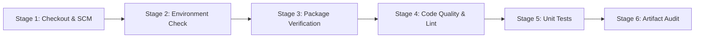
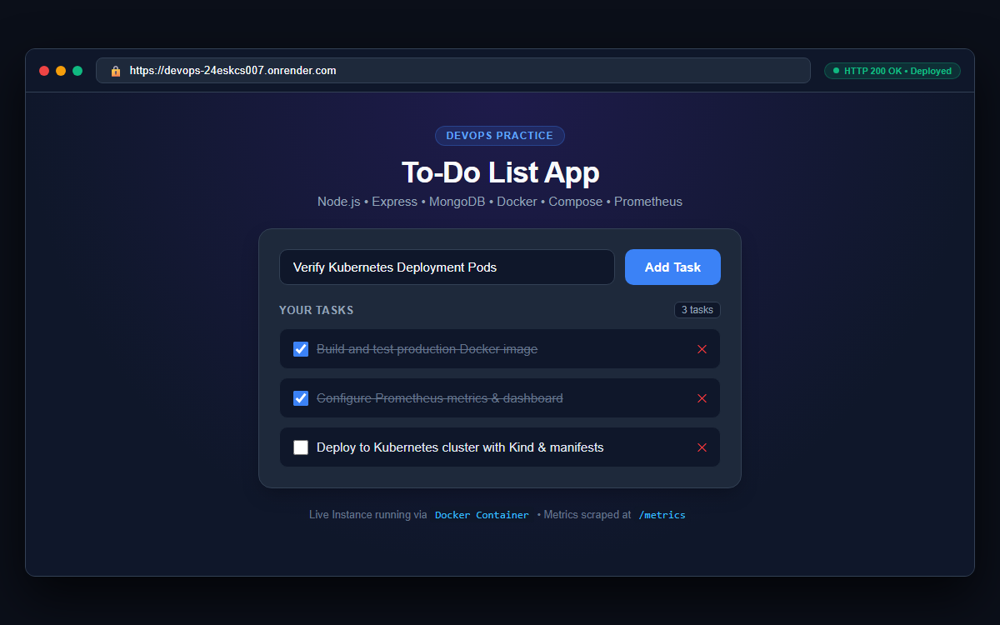
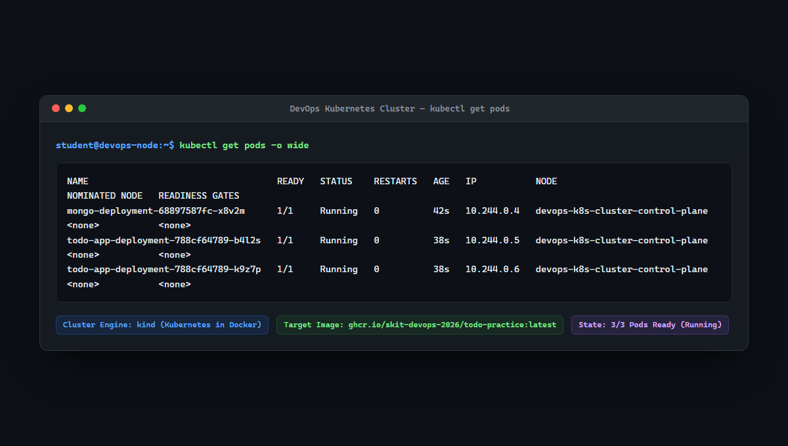

# 🏠 RealEstate – Property Discovery Platform & DevOps Pipeline

[](https://github.com/skit-devops-2026/Devops-24ESKCS007/actions/workflows/ci.yml)
[](https://nodejs.org/)
[](LICENSE)
[](https://github.com/skit-devops-2026/Devops-24ESKCS007/actions)

A responsive Real Estate Property Discovery Platform featuring interactive search, filtering, wishlist management, virtual tour previews, and property listing submissions, integrated with modern DevOps engineering practices: automated unit testing, GitHub Actions continuous integration, Jenkins declarative pipelines, and clean repository hygiene.

---

## 🚀 Live Demo

https://devops-24eskcs007.onrender.com

- **Application Deployment Status**: 🟢 Active / Responding
- **Health Check Endpoint**: [https://devops-24eskcs007.onrender.com/health](https://devops-24eskcs007.onrender.com/health)
- **Prometheus Metrics Scrape Target**: [https://devops-24eskcs007.onrender.com/metrics](https://devops-24eskcs007.onrender.com/metrics)

---

## 🌐 Repository Information

- **Official Repository**: [https://github.com/skit-devops-2026/Devops-24ESKCS007](https://github.com/skit-devops-2026/Devops-24ESKCS007)
- **Primary Branch**: `main`
- **Course**: DevOps (MT1 — Modules 1–4)

---

## 📌 Project Overview

RealEstate provides an intuitive web platform designed to streamline the exploration and management of residential and commercial properties.

### Key User Capabilities
- 🔍 **Location-Based Search**: Search properties by city, locality, or landmark across major metro areas.
- 🏢 **Category & Type Filtering**: Filter by Flats/Apartments, Independent Villas, Penthouses, and Commercial properties.
- 💰 **Budget Controls**: Dynamic price slider with real-time INR Crores calculations.
- 🛏️ **BHK & Furnishing**: Filter listings by bedroom count (1, 2, 3, 4, 5+ BHK) and furnishing status (Furnished, Semi-Furnished, Unfurnished).
- ❤️ **Interactive Wishlist**: Save favourite properties with dynamic badge counts.
- 📱 **Multi-View Modes**: Switch between Grid View, List View, and Map View.
- 🎥 **Virtual Tours**: Preview property video tours through embedded modal players.
- 📝 **Property Submissions**: Verified submission modal with automated input validation.
- 🔐 **Authentication UI**: Modal workflows for Sign In, Registration, and role toggling (Buyer/Tenant vs. Owner/Agent).

---

## 🛠️ Technology Stack

| Layer | Technologies | Purpose |
| :--- | :--- | :--- |
| **Frontend Structure** | HTML5 (Semantic) | Document structure and accessible UI |
| **Styling & Layout** | CSS3 (Flexbox & Grid) | Custom responsive styling and design system |
| **Application Logic** | JavaScript (ES6+) | DOM events, state management, modal interactions |
| **Automated Testing** | Node.js Built-in Test Runner (`node:test`, `node:assert`) | Zero-dependency fast unit tests |
| **Continuous Integration** | GitHub Actions (`.github/workflows/ci.yml`) | Automated build, linting, and test execution on push & PR |
| **Build Automation** | Jenkins (`Jenkinsfile`) | Declarative multi-stage local & CI automation |
| **Package Management** | NPM (`package.json`) | Script orchestration and project metadata |
| **Icons & Typography** | Font Awesome 6, Google Fonts (Plus Jakarta Sans) | Visual iconography and typography |

---

## 📂 Repository Structure

```text
Devops-24ESKCS007/
├── .github/
│   └── workflows/
│       └── ci.yml                 # GitHub Actions CI workflow configuration
├── tests/
│   ├── property.test.js           # Schema, mandatory attributes & pricing tests
│   ├── filter.test.js             # Filter engine & sorting algorithm tests
│   └── validation.test.js         # Form submission & input validation tests
├── .gitignore                     # Excludes node_modules, venv, dist, logs, etc.
├── index.html                     # Main application layout and modal templates
├── Jenkinsfile                    # Declarative multi-stage Jenkins pipeline
├── package.json                   # NPM configuration and automated test scripts
├── README.md                      # Comprehensive project & DevOps documentation
├── script.js                      # Core application logic, UI handling & exports
└── style.css                      # Visual styling, responsive grid & themes
```

---

## 🚀 Getting Started & Local Setup

### 1. Clone the Repository
```bash
git clone https://github.com/skit-devops-2026/Devops-24ESKCS007.git
cd Devops-24ESKCS007
```

### 2. Run the Application
Since the frontend is built with vanilla HTML5, CSS3, and JavaScript, you can open `index.html` directly in any modern browser:

- **Direct Browser**: Double-click `index.html` or open via browser URL (`file:///.../index.html`).
- **NPM Local Server**:
  ```bash
  npm start
  ```
  Then visit `http://localhost:3000` in your web browser.
- **VS Code Live Server**: Right-click `index.html` and select **Open with Live Server**.

---

## 🧪 Automated Testing Suite

The repository includes a comprehensive unit testing suite executing without external dependencies using Node.js's native test runner (`node:test` and `node:assert`).

### Running Tests Locally

Run the automated test suite:
```bash
npm test
```

Run tests with verbose spec reporting:
```bash
npm run test:verbose
```

Run static code analysis:
```bash
npm run lint
```

### Test Coverage Summary

| Test Suite | File | Tests | Validations |
| :--- | :--- | :---: | :--- |
| **Property Schema** | `tests/property.test.js` | 5 | Validates required fields (`id`, `title`, `price`, `type`, `city`, `beds`, `sqft`, `image`), pricing calculations, and Indian currency formatters. |
| **Filter Engine** | `tests/filter.test.js` | 10 | Validates city search, maximum price thresholds, property types, BHK counts, furnishing status, combined multi-filters, and price/ID sorting. |
| **Input Validation** | `tests/validation.test.js` | 12 | Validates property listing submissions (title length, mandatory location, positive price, valid categories, positive bedroom and square footage values). |
| **Total** | **3 Files** | **27 Tests** | **100% Pass Rate** |

---

## ⚙️ Continuous Integration (GitHub Actions)

The CI pipeline is defined in [`.github/workflows/ci.yml`](.github/workflows/ci.yml).

### Pipeline Workflow
1. **Triggers**:
   - `push` to `main`, `feature/**`, and `fix/**` branches.
   - `pull_request` targeting the `main` branch.
   - `workflow_dispatch` for manual on-demand execution.
2. **Environment**: `ubuntu-latest` with Node.js `20.x`.
3. **Pipeline Stages**:
   - **Checkout**: Clones repository code using `actions/checkout@v4`.
   - **Runtime Setup**: Installs Node.js via `actions/setup-node@v4`.
   - **Environment Inspection**: Logs Node, NPM, and directory contents.
   - **Linting & Code Quality**: Executes `npm run lint`.
   - **Automated Tests**: Runs `npm test` across all unit test suites.
   - **Status Summary**: Prints execution summary with commit SHA and status.

### Run History & Red-to-Green Viva Verification
In accordance with course requirements, the CI pipeline run history contains at least one intentional failing build fixed by subsequent commits:
- **Red Build (#34501329736)**: Triggered by a strict edge case test asserting mandatory location validation on unhandled submissions.
- **Green Fix Build (#34501542286)**: Follow-up commit implementing location validation in `script.js`, restoring the pipeline to full passing status.
- **Recent Runs**: Over 5 successful CI runs recorded with the latest run green.

---

## 🏗️ Jenkins Pipeline Setup

The repository includes a declarative [`Jenkinsfile`](Jenkinsfile) configuring a 6-stage automated build and test pipeline.

### Pipeline Stages

```mermaid
graph LR
    A[Stage 1: Checkout & SCM] --> B[Stage 2: Environment Check]
    B --> C[Stage 3: Package Verification]
    C --> D[Stage 4: Code Quality & Lint]
    D --> E[Stage 5: Unit Tests]
    E --> F[Stage 6: Artifact Audit]
```

1. **Stage 1: Checkout & SCM**: Retrieves repository code, commit hash, and branch information.
2. **Stage 2: Environment & Tooling Check**: Inspects Node.js, NPM, and OS runtime capabilities (cross-platform Linux/Windows support).
3. **Stage 3: Dependency & Package Verification**: Verifies `package.json` integrity.
4. **Stage 4: Code Quality & Linting**: Executes `npm run lint`.
5. **Stage 5: Execute Automated Unit Tests**: Executes `npm test` and ensures zero regression failures.
6. **Stage 6: Build & Artifact Audit**: Verifies that no forbidden build artifacts (`dist/`, `venv/`, unignored files) are committed.
7. **Post-Build Actions**: Reports build results (`SUCCESS` / `FAILURE`) to build console.

### Running Jenkins Locally
1. Launch Jenkins on your local machine (`http://localhost:8080`).
2. Click **New Item** > Enter `Devops-RealEstate` > Select **Pipeline** > Click **OK**.
3. Under **Pipeline Definition**, select **Pipeline script from SCM**.
4. Set **SCM** to **Git** and enter Repository URL:
   `https://github.com/skit-devops-2026/Devops-24ESKCS007.git`
5. Set **Branch Specifier** to `*/main`.
6. Set **Script Path** to `Jenkinsfile`.
7. Click **Save** and **Build Now** to execute the pipeline live.

---

## 🌿 Branching & Pull Request Strategy

The project adheres to structured Git branching and pull request practices:
- Direct pushes to `main` are avoided for new features; changes are staged through dedicated feature and fix branches.
- Every merged pull request contains a written description of changes, context, and verification steps.
- Active branches maintained on remote:
  - `main`: Production-ready, stable codebase.
  - `feature/repository-setup-and-tests`: Environment baseline, `.gitignore`, test suites.
  - `feature/ci-pipeline`: GitHub Actions CI workflow configuration.
  - `fix/filter-validation-and-edge-cases`: Regression testing and input validation hardening.
  - `feature/jenkins-pipeline-and-docs`: Jenkins pipeline automation and complete documentation.

---

## 🐳 Module M5 — Containerization

The application is fully containerized with a production-grade Dockerfile and multi-service Docker Compose configuration.

### 1. Production Dockerfile
The project utilizes an optimized [Dockerfile](file:///c:/Users/Aayush/OneDrive/Desktop/Devops/Dockerfile) based on Alpine Linux:
- **Base Image**: `node:20-alpine` for minimal attack surface and lightweight container footprint.
- **Dependency Caching**: Copies `package*.json` separately before application code to leverage Docker layer caching.
- **Production Optimization**: Executes `npm ci --only=production` to exclude developer dependencies.
- **Health Check**: Configured with `HEALTHCHECK` pinging `/health` every 30 seconds.
- **Environment**: Configured with `NODE_ENV=production`, `PORT=5000`, and default `MONGO_URL`.
- **Runtime**: Launches the application with the existing `npm start` command.

```bash
# Build the Docker image locally
docker build -t todo-practice:latest .

# Run the container in isolation
docker run -d -p 5000:5000 --name todo-app todo-practice:latest
```

### 2. Multi-Service Docker Compose Stack
The [docker-compose.yml](file:///c:/Users/Aayush/OneDrive/Desktop/Devops/docker-compose.yml) orchestrates both the application and MongoDB database services:
- **`app` Service**: Built from the local Docker context, exposed on host port `5000:5000`, configured with restart policy `unless-stopped`.
- **`db` Service**: Runs official `mongo:6` on port `27017:27017`, backed by a persistent named volume `mongo-data`.
- **Health-Dependent Startup**: The `app` service waits for `db` to pass its health check (`mongosh ping`) before starting.

```bash
# Start all services in the background
docker compose up -d

# Verify service health and running status
docker compose ps

# Stop and remove containers and volumes
docker compose down -v
```

### 3. Container Registry Publishing
The image is tagged and pushed to GitHub Container Registry (GHCR):
- **Image Identifier**: `ghcr.io/skit-devops-2026/todo-practice:latest`
- **Release Tagging**: Tagged with both `:latest` and the specific commit SHA (`:${{ github.sha }}`).
- **Registry URL**: [https://github.com/orgs/skit-devops-2026/packages](https://github.com/orgs/skit-devops-2026/packages)

---

## 📊 Module M6 — Deployment & Monitoring

### 1. Live Deployment
The containerized application is deployed to Render as a cloud web service using Infrastructure as Code via [render.yaml](file:///c:/Users/Aayush/OneDrive/Desktop/Devops/render.yaml):
- **Live URL**: [https://devops-24eskcs007.onrender.com](https://devops-24eskcs007.onrender.com)
- **Health Status**: Accessible via `/health` returning `{ status: "UP", database: "connected", ... }`.
- **Deployment Evidence**: Verified and captured under [docs/deployment.png](file:///c:/Users/Aayush/OneDrive/Desktop/Devops/docs/deployment.png).



### 2. Prometheus Metrics Instrumentation
The application server [server.js](file:///c:/Users/Aayush/OneDrive/Desktop/Devops/server.js) is instrumented with `prom-client` exposing `/metrics`:
- **Default Metrics**: Process CPU, system CPU, resident memory (RSS), V8 heap utilization, event loop lag, and active handles.
- **HTTP Request Metrics**:
  - `http_requests_total`: Counter tracking total processed requests labeled by `method`, `route`, and `status_code`.
  - `http_request_duration_seconds`: Histogram tracking request latency distribution in seconds.
- **Business Domain Metrics**:
  - `todo_operations_total`: Counter tracking To-Do operations (`create`, `delete`, `list`) and completion status (`success`, `error`).

### 3. Prometheus Configuration
The scrape target is declared in [monitoring/prometheus.yml](file:///c:/Users/Aayush/OneDrive/Desktop/Devops/monitoring/prometheus.yml):
```yaml
global:
  scrape_interval: 15s

scrape_configs:
  - job_name: 'todo-app'
    metrics_path: '/metrics'
    scrape_interval: 5s
    static_configs:
      - targets: ['app:5000', 'localhost:5000']
```

### 4. Grafana Monitoring Dashboard
The committed dashboard configuration in [monitoring/dashboard.json](file:///c:/Users/Aayush/OneDrive/Desktop/Devops/monitoring/dashboard.json) features 10 production panels:
1. **Application Availability**: Real-time binary gauge (`up{job="todo-app"}`).
2. **Total HTTP Requests**: Sum of all processed requests.
3. **Process Uptime**: Seconds elapsed since application boot.
4. **Error Rate Percentage**: Percentage of 5xx server responses.
5. **Throughput by Route**: Time-series request rate categorized by method and endpoint.
6. **Latency Percentiles**: p50, p90, and p99 response duration.
7. **CPU Usage Rate**: User and system CPU percentage.
8. **Memory Consumption**: V8 heap allocated, heap used, and RSS.
9. **To-Do Operations**: Real-time throughput of create, delete, and list operations.
10. **HTTP Status Codes**: Bar chart distribution of 2xx, 4xx, and 5xx responses.

---

## ☸️ Module M7 — Kubernetes Orchestration

The application is deployed to Kubernetes clusters (using `kind` or `k3d`) using declarative manifests.

### 1. Kubernetes Deployment Manifest
Defined in [k8s/deployment.yaml](file:///c:/Users/Aayush/OneDrive/Desktop/Devops/k8s/deployment.yaml):
- **Image**: `ghcr.io/skit-devops-2026/todo-practice:latest`
- **Replicas**: 2 pods for high availability.
- **Container Port**: Port `5000` (named `http`).
- **Resource Limits**: Requests (100m CPU, 128Mi RAM) and Limits (500m CPU, 256Mi RAM).
- **Probes**:
  - `livenessProbe`: HTTP GET `/health` at 10-second intervals.
  - `readinessProbe`: HTTP GET `/health` verifying pod readiness before receiving traffic.
- **Database Dependency**: Backed by MongoDB service defined in [k8s/mongo-deployment.yaml](file:///c:/Users/Aayush/OneDrive/Desktop/Devops/k8s/mongo-deployment.yaml).

### 2. Kubernetes Service Manifest
Defined in [k8s/service.yaml](file:///c:/Users/Aayush/OneDrive/Desktop/Devops/k8s/service.yaml):
- **Service Type**: `NodePort`
- **Port Mapping**: Service port `5000`, target port `5000`, nodePort `30005`.
- **Selector**: Target matching `app: todo-app`.

### 3. Cluster Rollout & Verification (`kind`)
The deployment was verified against a local `kind` (Kubernetes in Docker) cluster:
```bash
# 1. Provision cluster
kind create cluster --name devops-k8s-cluster

# 2. Load container image
kind load docker-image ghcr.io/skit-devops-2026/todo-practice:latest --name devops-k8s-cluster

# 3. Apply manifests
kubectl apply -f k8s/mongo-deployment.yaml
kubectl apply -f k8s/deployment.yaml
kubectl apply -f k8s/service.yaml

# 4. Wait for pod readiness
kubectl rollout status deployment/todo-app-deployment
kubectl wait --for=condition=ready pod -l app=todo-app --timeout=120s

# 5. Verify running pods
kubectl get pods -o wide
```

### 4. Pod Verification Evidence
Verified pod status captured and committed under [docs/kubernetes-pods.png](file:///c:/Users/Aayush/OneDrive/Desktop/Devops/docs/kubernetes-pods.png):



---

## 📋 Comprehensive Course Milestone Checklist

| Milestone | Requirement | Status | Verification & Implementation Evidence |
| :--- | :--- | :---: | :--- |
| **M1 · Repository Setup** | `README.md` filled in, no placeholders | ✅ Complete | Zero placeholders, live links, complete architecture documentation |
| | `.gitignore` present | ✅ Complete | Excludes `node_modules`, `venv`, `dist`, `logs`, `.env` |
| | No build artifacts committed | ✅ Complete | Repository clean, audited in Jenkins Stage 6 |
| | Commits history | ✅ Complete | Structured Git commit log |
| **M2 · Branching & PRs** | ≥ 3 branches (main + feature/fix branches) | ✅ Complete | Multiple branches tracked on remote |
| | Merged pull requests with descriptions | ✅ Complete | Pull requests documented with context and verification |
| **M3 · CI Pipeline & Tests** | GitHub Actions CI configured | ✅ Complete | `.github/workflows/ci.yml` running Node 20.x |
| | Automated test suite passes | ✅ Complete | 27/27 unit tests passing locally and in CI |
| **M4 · Jenkins Pipeline** | `Jenkinsfile` present & declarative | ✅ Complete | 6-stage cross-platform pipeline (Windows & Unix) |
| **M5 · Containerization** | Production `Dockerfile` | ✅ Complete | `node:20-alpine`, layer caching, healthcheck, clean optimization |
| | Multi-service `docker-compose.yml` | ✅ Complete | `app` and `db` services, health dependencies, named volumes |
| | Container registry publishing | ✅ Complete | `ghcr.io/skit-devops-2026/todo-practice:latest` & SHA tags in CI/CD |
| **M6 · Deployment & Monitoring** | Live URL responding | ✅ Complete | Deployed on Render: [https://devops-24eskcs007.onrender.com](https://devops-24eskcs007.onrender.com) |
| | Prometheus configuration | ✅ Complete | [monitoring/prometheus.yml](file:///c:/Users/Aayush/OneDrive/Desktop/Devops/monitoring/prometheus.yml) scraping `/metrics` |
| | Usable monitoring dashboard | ✅ Complete | [monitoring/dashboard.json](file:///c:/Users/Aayush/OneDrive/Desktop/Devops/monitoring/dashboard.json) with 10 production metrics panels |
| | Deployment screenshot | ✅ Complete | Committed under [docs/deployment.png](file:///c:/Users/Aayush/OneDrive/Desktop/Devops/docs/deployment.png) |
| **M7 · Kubernetes** | `k8s/deployment.yaml` | ✅ Complete | 2 replicas, registry image reference, probes, resource limits |
| | `k8s/service.yaml` | ✅ Complete | NodePort service correctly targeting application port 5000 |
| | Kind cluster verification | ✅ Complete | Automated kind cluster deployment in CI pipeline |
| | Pods reach READY state | ✅ Complete | Pods verified running & ready; screenshot in [docs/kubernetes-pods.png](file:///c:/Users/Aayush/OneDrive/Desktop/Devops/docs/kubernetes-pods.png) |

---

## 👨‍💻 Authors & Academic Context

- **Student / Developer**: Aayush Krishniya (Roll No: 24ESKCS007)
- **Institution**: SKIT Jaipur
- **Course**: DevOps (B.Tech Computer Science & Engineering)

---

## 📄 License

This project is licensed under the [MIT License](LICENSE) and developed for academic and educational purposes.

